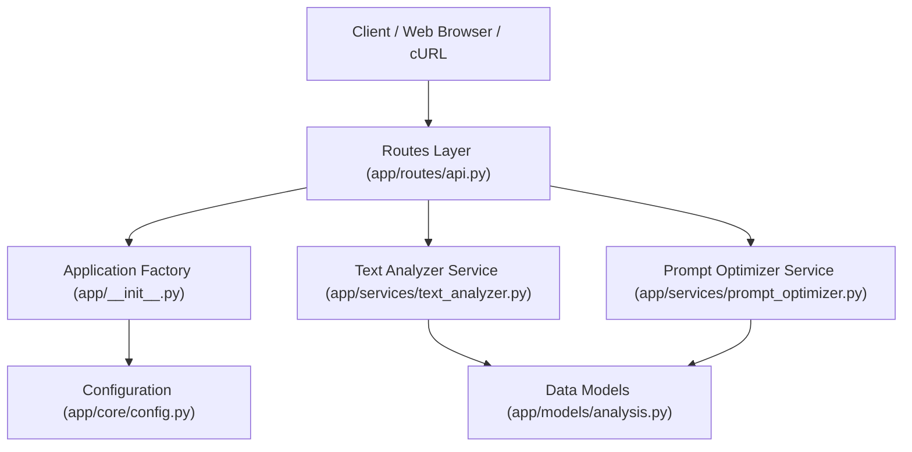

# 📖 الدليل الشامل لتشغيل وبناء مشروع: SmartText AI & Vibe Studio

> **مشروع معمل الذكاء الاصطناعي (AI Lab Assignment)**  
> **مُقدّم للدكتور:** د. محمد الضبعي  
> **موعد التسليم:** يوم الجمعة، الساعة 9:00 مساءً  
> **حالة المستودع:** عام (Public Repository)

---

## 📑 جدول المحتويات (Table of Contents)
1. [نظرة عامة على المشروع وأهدافه](#1-نظرة-عامة-على-المشروع-وأهدافه)
2. [التقنيات والأدوات المستخدمة (Tech Stack & Tools)](#2-التقنيات-والأدوات-المستخدمة-tech-stack--tools)
3. [كيف تم بناء المشروع؟ (Architecture & Design Patterns)](#3-كيف-تم-بناء-المشروع-architecture--design-patterns)
4. [التطبيق العملي لمفاهيم الدورة الأربعة](#4-التطبيق-العملي-لمفاهيم-الدورة-الأربعة)
   - [أولاً: أوامر لينكس (Linux Commands)](#أولاً-أوامر-لينكس-linux-commands)
   - [ثانياً: أوامر Git و GitHub](#ثانياً-أوامر-git-و-github)
   - [ثالثاً: البرمجة النظيفة (Clean Coding)](#ثالثاً-البرمجة-النظيفة-clean-coding)
   - [رابعاً: البرمجة التفاعلية السريعة (Vibe Coding)](#رابعاً-البرمجة-التفاعلية-السريعة-vibe-coding)
5. [دليل التشغيل خطوة بخطوة (How to Run)](#5-دليل-التشغيل-خطوة-بخطوة-how-to-run)
   - [أ. التشغيل على أنظمة لينكس / WSL / Git Bash](#أ-التشغيل-على-أنظمة-لينكس--wsl--git-bash)
   - [ب. التشغيل على نظام Windows (PowerShell)](#ب-التشغيل-على-نظام-windows-powershell)
6. [دليل لقطات الشاشة الإلزامية للتسليم (Screenshots Guide)](#6-دليل-لقطات-الشاشة-الإلزامية-للتسليم-screenshots-guide)
7. [خطوات رفع المشروع إلى GitHub كـ Public وإرساله](#7-خطوات-رفع-المشروع-إلى-github-كـ-public-وإرساله)

---

## 1. نظرة عامة على المشروع وأهدافه

تم تصميم وبناء **SmartText AI & Vibe Studio** ليكون تطبيق ويب عملياً وواقعياً يبرهن على استيعاب الطالب لجميع المهارات التأسيسية التي تم تدريسها في معمل الذكاء الاصطناعي:
- **تحليل النصوص والمشاعر (Text & Sentiment Analysis):** واجهة ويب تقوم بتحليل أي نص (باللغتين العربية والإنجليزية)، واستخراج عدد الكلمات، الحروف، الجمل، زمن القراءة التقديري، تصنيف نبرة النص (إيجابي / محايد / سلبي)، واستخراج أهم الكلمات المفتاحية والملخص التلقائي.
- **استوديو هندسة الأوامر (Vibe Coding Studio):** أداة متقدمة تحاكي منهجية الـ Vibe Coding، حيث تأخذ فكرة عفوية غير مهيكلة من المستخدم وتحولها تلقائياً إلى أمر ذكاء اصطناعي احترافي مهيكل (Prompt Engineering) يحتوي على الدور والمهام والقيود وصيغة المخرجات.
- **فحص السيرفر والتحكم البرمجي:** توفير نقاط اتصال برمجية (RESTful APIs) تدعم أوامر الفحص والمراقبة من خلال أدوات بيئة لينكس مثل `curl` و `grep`.

---

## 2. التقنيات والأدوات المستخدمة (Tech Stack & Tools)

| التقنية / الأداة | الإصدار / النوع | سبب الاستخدام وفائدتها في المشروع |
| :--- | :--- | :--- |
| **Python** | 3.10+ (تم الاختبار على 3.13) | اللغة الأساسية في تطبيقات الذكاء الاصطناعي وهندسة البرمجيات الحديثة. |
| **Flask** | 3.1+ | إطار عمل ويب خفيف وسريع ومرن، مثالي لبناء تطبيقات Clean Architecture دون تعقيد زائد. |
| **Pytest** | 9.1+ | إطار الاختبارات الآلية المعتمد في مجتمع بايثون، يضمن تطبيق مفهوم الـ Test-Driven Development وموثوقية الكود. |
| **Dataclasses & Typing** | مدمج في بايثون | تطبيق صارم للكود النظيف عبر Type Annotations ومنع أخطاء البيانات وتسهيل التوثيق الذاتي للكود. |
| **Tailwind CSS** | CDN v3 | بناء واجهة مستخدم مظلمة (Dark Mode) عصرية جداً بنظام الـ Glassmorphism السريع دون الحاجة لتثبيت حزم Node.js ثقيلة (تطبيق مباشر لروح الـ Vibe Coding). |
| **Lucide Icons** | CDN | مكتبة أيقونات متجهة مفتوحة المصدر لإعطاء مظهر تفاعلي واحترافي للواجهة. |
| **Bash Shell Scripting** | GNU Bash | تنفيذ أتمتة بيئة لينكس (`setup.sh`, `run.sh`, `health_check.sh`). |
| **GNU Make (Makefile)** | Build Automation | توفير أوامر موحدة لمطوري لينكس لتشغيل واختبار وتنظيف المشروع بأمر واحد (`make run`, `make test`). |
| **Git & GitHub** | v2.5+ | نظام إدارة الإصدارات والعمل الجماعي وحفظ مراحل المشروع. |

---

## 3. كيف تم بناء المشروع؟ (Architecture & Design Patterns)

تم بناء المشروع باتباع **معمارية الطبقات المنفصلة (Layered / Clean Architecture)** مع الالتزام بمبادئ **SOLID**:



### الأنماط التصميمية المطبقة (Design Patterns):
1. **نمط مصنع التطبيق (Application Factory Pattern):**
   - الكود موجود في [`app/__init__.py`](file:///app/__init__.py) عبر دالة `create_app()`.
   - **الفائدة:** يتيح عزل إنشاء التطبيق، مما يسمح بحقن إعدادات الاختبار (`TESTING=True`) بدون التأثير على بيئة التشغيل الحقيقية، ويسهل قابلية التوسع.
2. **مبدأ المسؤولية الفردية (Single Responsibility Principle - SRP):**
   - كل ملف يركز على مهمة واحدة محددة:
     - `app/models/analysis.py`: مسؤول حصراً عن تعريف هياكل البيانات والـ schemas.
     - `app/services/text_analyzer.py`: مسؤول حصراً عن معالجة النصوص وحساب المشاعر والقراءة.
     - `app/services/prompt_optimizer.py`: مسؤول حصراً عن هندسة أوامر الـ AI.
     - `app/routes/api.py`: مسؤول فقط عن استقبال طلبات HTTP والتحقق منها وإرجاع ردود الـ JSON.
3. **التصميم الخالي من الاعتماديات الثقيلة (Zero Heavy Dependencies):**
   - تم بناء محرك المشاعر والكلمات المفتاحية باستخدام بايثون القياسي وRegex وCounter، مما يضمن أن التطبيق يعمل على الفور في أي نظام لينكس، ويندوز، أو حاوية Docker بدون أخطاء توافقية أو تجميع مكتبات ثقيلة مثل C++ compilers.
4. **دعم تشفير الحروف العالمي (UTF-8 Stream Safety):**
   - تم تضمين معالجة في [`run.py`](file:///run.py) تضمن عمل الرموز والنصوص العربية والإنجليزية على جميع شاشات الطرفية بدون أخطاء `UnicodeEncodeError`.

---

## 4. التطبيق العملي لمفاهيم الدورة الأربعة

### أولاً: أوامر لينكس (Linux Commands)

يحتوي المشروع على ملفات وسكربتات لينكس مخصصة تُظهر إتقان التعامل مع الطرفية:

| أمر لينكس | الغرض والوظيفة في المشروع | مثال التنفيذ |
| :--- | :--- | :--- |
| `ls -la` | عرض جميع الملفات بما فيها الملفات المخفية مثل `.gitignore` وصلاحياتها وتواريخ تعديلها. | `ls -la` |
| `chmod +x` | منح صلاحيات التنفيذ للسكربتات في مجلد `scripts/`. | `chmod +x scripts/*.sh` |
| `cat` | استعراض محتويات الملفات البرمجية والإعدادات مباشرة من الطرفية. | `cat requirements.txt` |
| `grep` | البحث والفلترة داخل الملفات أو استجابات السيرفر. | `grep "Flask" requirements.txt` |
| `curl` | إجراء طلبات HTTP برمجية من الطرفية لفحص صحة السيرفر ونقاط الـ API. | `curl -i http://127.0.0.1:5000/api/health` |
| `ps` و `kill` | مراقبة عمليات بايثون النشطة في الذاكرة وإدارتها في لينكس. | `ps aux \| grep python` |
| `bash` | تشغيل سكربتات الباش المؤتمتة الخاصة بالتهيئة والفحص. | `bash scripts/setup.sh` |
| `make` | تنفيذ مهام الـ Makefile المؤتمتة للبناء والاختبار. | `make test` أو `make run` |

---

### ثانياً: أوامر Git و GitHub

تم تطبيق دورة عمل احترافية (Professional Git Workflow):
1. **التهيئة والاستثناء (`.gitignore`):**
   - تم إنشاء ملف `.gitignore` شامل يمنع رفع مجلدات الكاش `__pycache__`، بيئات العمل الافتراضية `.venv/`، وملفات النظام المؤقتة.
2. **العمل عبر الفروع (Branching Strategy):**
   - عدم العمل المباشر على فرع الإنتاج؛ بل إنشاء فرع للميزة:
     ```bash
     git checkout -b feature/smart-text-analyzer
     ```
3. **رسائل الالتزام المعيارية (Conventional Commits):**
   - الالتزام بالبادئات القياسية:
     - `feat:` لإضافة ميزات برمجية جديدة.
     - `test:` لإضافة اختبارات آلية.
     - `docs:` لكتابة التوثيق وشرح المشروع.
4. **الدمج والرفع (Merge & Push to Public Remote):**
   - دمج الفرع بعد اكتمال الاختبارات في `main`.
   - رفع الكود إلى مستودع **Public** على GitHub لتمكين الدكتور محمد الضبعي من مراجعته.

---

### ثالثاً: البرمجة النظيفة (Clean Coding)

تتجلى البرمجة النظيفة في كل سطر داخل المشروع:
- **التوثيق بالـ Docstrings:** جميع الكلاسات والدوال موثقة بأسلوب Google/PEP 257 يشرح المدخلات (Args) والمخرجات (Returns).
- **التلميحات النوعية الصارمة (Strict Type Annotations):** مثل `def analyze(self, text: str) -> AnalysisResponse:`.
- **التسميات الدلالية المعبرة:** أسماء متغيرات واضحة (`reading_time_minutes`, `sentiment_score`) والابتعاد عن التسميات المبهمة.
- **الاختبارات الآلية (Automated Unit Tests):**
  - تم بناء 9 اختبارات تغطي:
    - إدخال نصوص فارغة (Graceful Degradation).
    - النصوص الإيجابية والسلبية بالإنجليزية.
    - النصوص باللغة العربية.
    - استخراج الكلمات الأكثر تكراراً.
    - فحص هيكلية محرك الأوامر الذكي.
    - فحص الـ HTTP Status Codes لنقاط الاتصال.

---

### رابعاً: البرمجة التفاعلية السريعة (Vibe Coding)

يمثل المشروع نموذجاً عملياً لـ **Vibe Coding**:
- **التطوير بمساعدة الذكاء الاصطناعي:** بناء نموذج أولي تفاعلي وجميل بوقت قياسي من خلال الدمج بين السرعة والدقة الهندسية.
- **حلقة التغذية الراجعة الفورية (Instant Feedback Loop):** يتم إدخال النص في المتصفح والحصول على النتائج الإحصائية وتغير لون مؤشر المشاعر تلقائياً في أجزاء من الثانية.
- **تبويب Vibe Prompt Studio المدمج:** استوديو عملي يوضح للدكتور مفهوم الـ Vibe Coding وكيف يمكن لمطور الذكاء الاصطناعي صياغة وتوليد أفضل الـ Prompts المنظمة لـ LLMs.

---

## 5. دليل التشغيل خطوة بخطوة (How to Run)

### أ. التشغيل على أنظمة لينكس / WSL / Git Bash

1. **الوصول لمجلد المشروع:**
   ```bash
   cd c:/Users/Eng_Ahmed/Desktop/GitHub/ai_lab_hw
   ```
2. **منح صلاحيات التنفيذ لسكربتات المشروع:**
   ```bash
   chmod +x scripts/*.sh
   ```
3. **تثبيت المتطلبات (Requirements):**
   ```bash
   pip install -r requirements.txt
   # أو يمكنك تشغيل سكربت الإعداد التلقائي:
   bash scripts/setup.sh
   ```
4. **تشغيل الاختبارات الآلية والتأكد من نجاحها:**
   ```bash
   pytest -v
   # أو عبر Makefile:
   make test
   ```
5. **تشغيل خادم الويب:**
   ```bash
   python run.py
   # أو عبر سكربت التشغيل:
   ./scripts/run.sh
   ```
6. **فحص صحة السيرفر من نافذة طرفية ثانية:**
   ```bash
   bash scripts/health_check.sh
   # أو بالأمر المباشر:
   curl -i http://127.0.0.1:5000/api/health
   ```

---

### ب. التشغيل على نظام Windows (PowerShell)

1. **فتح PowerShell في مسار المشروع:**
   ```powershell
   cd C:\Users\Eng_Ahmed\Desktop\GitHub\ai_lab_hw
   ```
2. **تثبيت المتطلبات:**
   ```powershell
   pip install -r requirements.txt
   ```
3. **تشغيل اختبارات الـ Pytest:**
   ```powershell
   pytest -v
   ```
4. **تشغيل السيرفر:**
   ```powershell
   python run.py
   ```
5. **فتح المتصفح:**
   انتقل إلى الرابط: **[http://127.0.0.1:5000](http://127.0.0.1:5000)**

---

## 6. دليل لقطات الشاشة الإلزامية للتسليم (Screenshots Guide)

> [!IMPORTANT]
> هذه اللقطات هي المطلوب تسليمها مع المشروع لتوثيق تنفيذ جميع المراحل برمجياً وعملياً. احفظ الصور داخل مجلد `screenshots/`:

| رقم | اسم ملف الصورة | الأمر أو المرحلة التي يجب تصويرها | ما يجب أن يظهر في الصورة بوضوح |
| :---: | :--- | :--- | :--- |
| **01** | `01_git_init_status.png` | `git init` ثم `git status` ثم `git add .` | تهيئة مستودع Git وظهور أسماء الملفات باللون الأخضر. |
| **02** | `02_git_commit_branch.png` | `git checkout -b feature/...` ثم `git commit -m "..."` | إنشاء الفرع الجديد وظهور رسالة الـ commit المعيارية. |
| **03** | `03_linux_commands.png` | `ls -la` و `chmod +x scripts/*.sh` و `grep "Flask" requirements.txt` | استعراض الملفات المخفية وصلاحيات التنفيذ والبحث النصي في لينكس. |
| **04** | `04_pytest_passed.png` | `pytest -v` | ظهور علامات النجاح الخضراء للاختبارات التسعة `9 passed in 0.54s`. |
| **05** | `05_app_running_terminal.png` | `python run.py` | تشغيل السيرفر ورابط الاستماع `http://127.0.0.1:5000`. |
| **06** | `06_web_analyzer_ui.png` | واجهة المتصفح في تبويب "Text & Sentiment Analyzer" | إدخال نص تجريبي وظهور إحصائيات الكلمات ونبرة المشاعر الإيجابية/السلبية. |
| **07** | `07_vibe_prompt_ui.png` | واجهة المتصفح في تبويب "Vibe Prompt Studio" | كتابة فكرة برمجية سريعة وظهور الـ Prompt المهيكل المولد للذكاء الاصطناعي. |
| **08** | `08_health_check_curl.png` | `curl -i http://127.0.0.1:5000/api/health` أو `bash scripts/health_check.sh` | استجابة السيرفر بحالة `HTTP 200 OK` وجسم الـ JSON بحالة `healthy`. |
| **09** | `09_github_repo_public.png` | صفحة المشروع على موقع GitHub | المستودع مرفوع بالكامل ومكتوب بجانبه بوضوح وسم **Public**. |

---

## 7. خطوات رفع المشروع إلى GitHub كـ Public وإرساله

1. **دمج فرع العمل إلى الفرع الرئيسي وإضافة لقطات الشاشة:**
   ```bash
   git checkout -b main
   git merge feature/smart-text-analyzer
   
   # إضافة لقطات الشاشة بعد حفظها داخل مجلد screenshots
   git add screenshots/
   git commit -m "docs: add comprehensive project screenshots for AI lab evaluation"
   ```

2. **إنشاء مستودع جديد على حسابك في GitHub:**
   - توجه إلى: [https://github.com/new](https://github.com/new)
   - اسم المستودع: `ai_lab_hw` أو `smart-text-ai-studio`.
   - **اختر الخيار: Public (عام) ⚠️ (مطلب أساسي من الدكتور).**
   - **لا تقم** باختيار "Add a README file" أو "Add .gitignore" لأن الملفات جاهزة وموجودة بالفعل على جهازك.

3. **ربط المستودع ورفع الملفات بالكامل:**
   ```bash
   git remote add origin https://github.com/<YOUR_GITHUB_USERNAME>/<REPO_NAME>.git
   git branch -M main
   git push -u origin main
   ```

4. **إرسال الواجب للدكتور محمد الضبعي:**
   - تأكد من فتح رابط المستودع في نافذة متصفح خاصة (Incognito) للتأكد من أنه يفتح بدون تسجيل دخول (للتأكد من أنه Public 100%).
   - أرسل الرابط للدكتور عبر القناة المعتمدة مع إرفاق أو الإشارة إلى مجلد `screenshots/` داخل المستودع.

---

> 🌟 **تم إعداد وتجهيز وتوثيق المشروع بالكامل ليكون نموذجاً هندسياً متميزاً يعكس الفهم الكامل لمفاهيم معمل الذكاء الاصطناعي.**
